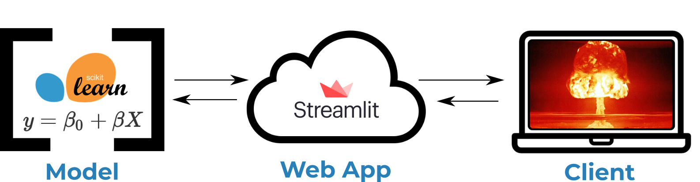

# Streamlit-based Web Application
#### SolutionMiners

## 1) Overview

classification-predict-streamlit-jm/resources/Images/banksy.jpg



This repository hosts code to deploy [Streamlit](https://www.streamlit.io/) web application that classifies user input text related to global warming as either as either Pro ,Nuetral ,Anti or news. It also has a natuaral language processing feature.

  

#### 1. Predict Tab
In the side bar drop down ,the user can choose the prediction tab .On this page ,the user is prompted to enter the text they wish to classify , order to determind if the it is either Pro ,Nuetral ,Anti or news.To classify this text ,there are 3 models to choose from which have been trained on the same data set and then prickled to deploy on the app.
The user has the option of Logistic regression, Random forest, or a Support vector machine learning model.After selecting a model,and upon  pressing the "classify" button ,the text is classified by the model of choice ,and the result is returned on screen with class and explaination.
https://github.com/Classification-Team-JM1/Classification_Predict_Package/blob/streamlit_resources/classification-predict-streamlit-jm/resources/imgs/Classes_discription.png

#### 2 .Purpose of the App 
On this tab ,the user can read about why this app was develpoed and how it can be benefitial to them.There is also some brief information as to
why knowing about how people general feel about man-man climate change can be beneficial to them.

#### 3 .Exploratory data Analyses 
Here the user gets to see the data used to develop the machine learning models in the app in the form of cool visual .
The user gets to see the raw data set as it was collected and the final dataset .


##### 4.Machine Learning Tab 
On this tap ,the user can read about the tree machine learning models in the app ,how they work ,how they were trained and how well they performed during training .The user is offered a brief introduction to Logistic Regression ,Random forest and Support vector machine learning algorithm and how they make a prediction .There are also links to sklearn documentation ,which are more technical.


##### 5. Global Warming in 5 minutes

On this tap ,the user can read about Global warming ,what it is and what scientific evidence support that it exist and how it has changed over the years

#### 6.Natural Language Processing 
Here the user gets a glimse of how a computer is able to process natual language .

For this repository, the most crucial file:

| File Name                |   Description                       |
| :---------------------   | :--------------------             |
| `Solution_miners_app.py`          | Streamlit application definition. |

## 2) Usage Instructions
The uses an API to run on aws


#### 2.2) Running the Streamlit web app on your local machine
With the Solution_Minors script ,the app can be ran on a local machine 

To do this, follow the steps below by running the given commands within a Git bash (Windows), or terminal (Mac/Linux):

 1. Ensure prerequisite Python libraries installed on your local machine:

 ```bash
 pip install -U streamlit numpy pandas scikit-learn
 ```

 ```bash
 git clone https://github.com/{your-account-name}/classification-predict-streamlit-template.git
 ```  

 3. Navigate to the base of the cloned repo, and start the Streamlit app.

 ```bash
 cd directory where the repo was cloned 
 streamlit run base_app.py
 ```

 If the web server was able to initialise successfully, the following message is displayed within your bash/terminal session:

```
  The Streamlit app can now be viewed in your browser.

    Local URL: http://localhost:8501
    Network URL: http://192.168.43.41:8501
```

You should also be automatically directed to the base page of your web app:


Congratulations! You've now officially deployed opened the application!

While we leave the modification of your web app up to you, the latter process of cloud deployment is outlined within the next section.  

#### 2.4) Running Streamlit on a remote AWS EC2 instance


The following steps will enable you to run your web app on a remote EC2 instance, allowing it to the accessed by any device/application which has internet access.

Within these setup steps, we will be using a remote EC2 instance, which we will refer to as the ***Host***, in addition to our local machine, which we will call the ***Client***. We use these designations for convenience, and to align our terminology with that of common web server practices. In cases where commands are provided, use Git bash (Windows) or Terminal (Mac/Linux) to enter these.

1. Ensure that you have access to a running AWS EC2 instance with an assigned public IP address.

**[On the Host]:**

2. Install the prerequisite python libraries:

```bash
pip install -U streamlit numpy pandas scikit-learn
```

3. Clone your copy of the API repo, and navigate to its root directory:

```bash
git clone https://github.com/{your-account-name}/classification-predict-streamlit-template.git
cd classification-predict-streamlit-template/
```

| :information_source: NOTE :information_source:                                                                                                    |
| :--------------------                                                                                                                             |
| In the following steps we make use of the `tmux` command. This programme has many powerful functions, but for our purposes, we use it to gracefully keep our web app running in the background - even when we end our `ssh` session. |

4. Enter into a Tmux window within the current directory. To do this, simply type `tmux`.  

5. Start the Streamlit web app on port `5000` of the host

```bash
streamlit run --server.port 5000 base_app.py
```

If this command ran successfully, output similar to the following should be observed on the Host:

```
You can now view your Streamlit app in your browser.

  Network URL: http://172.31.47.109:5000
  External URL: http://3.250.50.104:5000

```

Where the specific `Network` and `External` URLs correspond to those assigned to your own EC2 instance. Copy the value of the external URL.  

**[On the Client]:**

6.  Within your favourite web browser (we hope this isn't Internet Explorer 9), navigate to external URL you just copied from the Host. This should correspond to the following form:

    `http://{public-ip-address-of-remote-machine}:5000`   

    Where the above public IP address corresponds to the one given to your AWS EC2 instance.

    If successful, you should see the landing page of your streamlit web app:


**[On the Host]:**

7. To keep your web app running continuously in the background, detach from the Tmux window by pressing `ctrl + b` and then `d`. This should return you to the view of your terminal before you opened the Tmux window.

    To go back to your Tmux window at any time (even if you've left your `ssh` session and then return), simply type `tmux attach-session`.

    To see more functionality of the Tmux command, type `man tmux`.

Having run your web app within Tmux, you should be now free to end your ssh session while your webserver carries on purring along. Well done :zap:!


